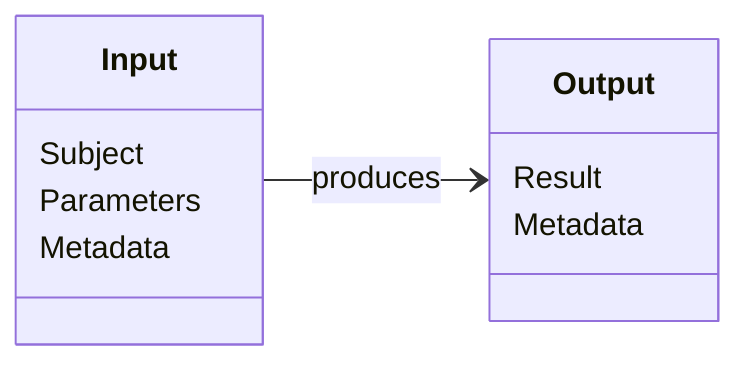
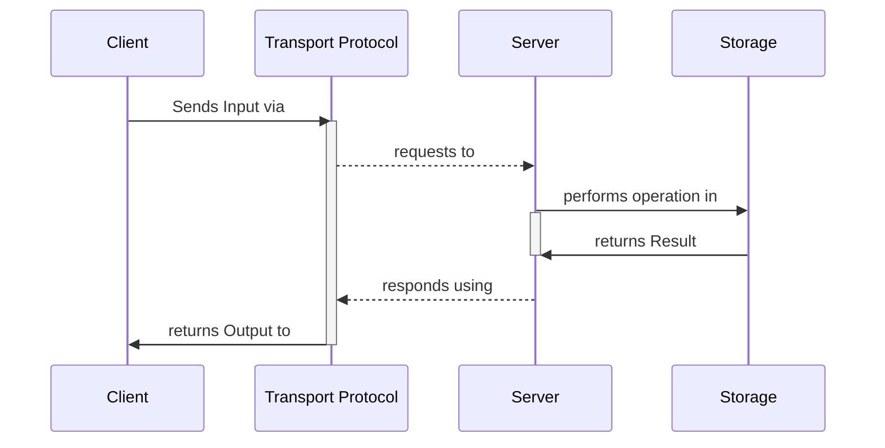

# 2. Terminology

## 2.1 CRUD Definition

**"CRUD"** is an acronym popularized in the early 1980s that encompasses two kinds of operations applied to Resources:

1. **Read operations**—such as querying, extracting, and aggregating Resources;
2. **Write operations**—which mutate the current state of Resources.

## 2.2 Anatomy and behavior of a CRUD operation

Traditionally, a **CRUD operation** is made of:

- **Input:** data used to perform the operation, broken down into:
    - **Subject:** the operation required data —such as Resource Objects, Search Queries, or Resource IDs;
    - **Parameters:** optional data that influences the operation behavior ****—such as sorting, projection, filtering, and pagination; and
    - **Metadata**—such as client-server negotiation information (content-type, encoding, serialization), metadata related to the operation, and client/server capabilities.
- **Output:** data returned from the operation, including:
    - **Result**—the result data, whether a Resource Object, an error, or null; and
    - **Metadata**—same as the **Input** metadata.

Therefore, a CRUD operation involves several **Participants**. This spec frequently cites them as the following terms:

- **Client**: The participant that initiates the CRUD operation with standardized Input data—for example, a web server writing to a database or a mobile app requesting data from a web API.
- **Transport Protocol**: The protocol used to 1) encapsulate the Input data sent to the Server and 2) return the Result to the Client. Examples include RESTful HTTP, JSON-RPC, and MCP.
- **Server**: The participant that performs the operation using the Input data and outputs the standardized Result—for example, a web API or database library compliant to this spec.
- **Storage:** The final destination where the operation is performed to the Resources, such as a database, filesystem, or another CRUD API.

## 2.3 The CRUD verbs

The CRUD API Spec redefines a set of verbs that goes beyond the traditional CRUD acronym. The HTTP Protocol methods themselves transcended these four traditional operations. For example, the "Retrieve" and the "Update" words hold ambiguous meanings that should be splitted into their distinct actions, such as list/get and patch/replace.

Given a Resource Type, the following table below describes and illustrates the **CRUD verbs**:

| Verb | Type | Description |
|------|------|-------------|
| `get` | Read | Retrieves a single Document |
| `list` | Read | Lists many Documents given a Search Query, optionally combining the result data with other Resources and/or processing the result data |
| `create` | Write | Creates one or many Documents |
| `patch` | Write | Updates one or many Documents' Properties |
| `replace` | Write | Fully replaces one or many Documents, with upsert capability |
| `delete` | Write | Removes one or many Documents |

## 2.4 The CRUD operations

Depending on the **Subject**, each verb can be executed differently. The CRUD verbs are therefore derived into the following **operations**, sometimes suffixed with the Subject type:

| Operation | Verb | Subject |
|-----------|------|---------|
| `get` | `get` | The Resource ID |
| `list` | `list` | Nothing; or a Search Query |
| `listByView` | `list` | A server-sided stored query, uniquely identified by a name (e.g. view) |
| `create` | `create` | One or many Documents |
| `patchById` | `patch` | The Resource ID + patch object |
| `patchByQuery` | `patch` | Language-specific search query + patch object |
| `replaceById` | `replace` | The Resource ID + Resource object |
| `replaceByQuery` | `replace` | Language-specific search query + Resource object |
| `deleteById` | `delete` | The Resource ID |
| `deleteByQuery` | `delete` | Language-specific search query |

## 2.5 General terminology

In addition to terms that appear in double quotes and bold formatting throughout this document, this spec frequently references the following terms and definitions:

**Slug**: An alphanumeric string in the format `^[a-zA-Z0-9_-]+$`, preferably lowercase.

**`uuid-hex`**: An UUID represented in its **[default encoding format](https://datatracker.ietf.org/doc/html/rfc4122#section-3)** (hexadecimal, lowercase, hyphens).

**`uuid-base64url`**: An UUID byte array represented as a [**base64url-encoded string**](https://datatracker.ietf.org/doc/html/rfc4648#section-5). Note that `base64url` replaces the 62nd and 63rd characters with `-` and `_` to make the encoding URL and filename safe, as specified in [**RFC 4648 ("Base-N Encodings")**](https://datatracker.ietf.org/doc/html/rfc4648#section-5).

**`uuid-ecson`**: An UUID represented as a JSON object and formatted as an [ECSON](https://github.com/ecson-spec/spec) Custom Type.

---

# 3. General rules and definitions

This section defines rules and definitions that apply to many or all CRUD operations.

## 3.1 Resources

A "**Resource**", "**Document**" or "**Resource Object**" is a data object that can be uniquely identified within the same API domain of data.

### 3.1.1 Resource Types and Collections

A "**Resource Type**" or "**Entity**" is a unique schema within the API domain that describes the structure of multiple Resources. For example, "User". A "**Collection**" is a set of Resources sharing the same Resource Type. For example, "users".

| Code | Requirement | Rule |
|------|-------------|------|
| `COLLECTION_SLUG` | **MUST** | Resource Types in the same CRUD API MUST be uniquely identified by [Slugs](/base/terminology/#slug), regardless of language-specific typing or naming. |

### 3.1.2 Resource Fields

A "**Resource Field**" or "**Property**" is an specific attribute of a Resource consisting of a key-value pair.

| Code | Requirement | Rule |
|------|-------------|------|
| `ID_KEY` | **MUST** | The `_id` field MUST be used to uniquely identify a Resource following the [Section 3.1.3 Resource IDs specs](/base/general/#313-resource-ids) below, except when it is a composite key. |
| `PROPS_NO_DOLLARS` | **MUST** | The `$` character is reserved to accommodate metadata information about a Document or about its Properties. Any Property that does not fulfill this objective are strictly FORBIDDEN to use this character as a prefix. The CRUD API operations MUST ignore those $-prefixed Properties in write operations and the clients SHOULD be able to negotiate them in read operations using projection parameters. |
| `PROPS_NO_UNDERSCORES` | **MUST** | The `_` character is reserved to prefix Properties that are part of an identity, primary key or a constraint inside the same Collection. Any Property that does not fulfill this objective are strictly FORBIDDEN to use this character as a prefix. |
| `PROPS_CAMEL_CASE` | **SHOULD** | Resource Fields in the same Resource Type SHOULD be formatted in camelCase. |

### 3.1.3 Resource IDs

A "**Resource ID**" is one or many Properties that uniquely identify a Resource.

| Code | Requirement | Rule |
|------|-------------|------|
| `ID_COMP_KEY_URLENCODED` | **MUST** | Resource IDs made of many properties (a.k.a. “composite keys”) MUST be represented in the format [`application/x-www-form-urlencoded`](https://url.spec.whatwg.org/#application/x-www-form-urlencoded). |
| `ID_SLUG` | **MUST** | A Resource ID MUST be represented as a [Slug](/base/terminology/#slug), except when it is a composite key. |
| `ID_UUID` | **SHOULD** | A Resource ID SHOULD be an UUID, preferred in the [`uuid-base64url`](/base/terminology/#uuid-base64url) format. |

### 3.1.4 Resource representation

A "**Resource Representation**" is the text format, encoding, and serialization used to represent or transport a Resource during a CRUD operation. This may or may not match how the Resource is stored logically.

| Code | Requirement | Rule |
|------|-------------|------|
| `DOC_ECSON_VERBOSE` | **MUST** | In the case of ECSON representation, the default [ECSON verbose mode](https://github.com/ecson-spec/spec) MUST be used to serialize the most common complex types. |
| `DOC_NO_ENVELOPES` | **MUST** | Resources MUST NOT be wrapped in envelopes such as `data`, `result`, `response`, or similar constructs. Operation Inputs and Outputs MUST always directly reflect Resources, optional Parameters (as defined by the Transport Protocol), or errors. |
| `DOC_ECSON` | **SHOULD** | If possible, [ECSON](https://github.com/ecson-spec/spec) serialization is very RECOMMENDED in order to preserve the type information between client and server. |
| `DOC_JSON` | **SHOULD** | The Resource representation during CRUD operations SHOULD be JSON. CRUD clients and servers SHOULD support JSON5 to allow more flexible JSON validation. |
| `DOC_ECSON_CUSTOM_TYPES` | **MAY** | In the case of ECSON representation, the [`ECSON.addType()` extension mechanism](https://github.com/ecson-spec/spec) MAY be used to serialize other custom types. |

## 3.2 Search queries

### 3.2.1 Definition and representation

A "**Search Query**" is a structured input string used to filter Documents during some CRUD operations. It includes Properties, operators, modifiers, and language-specific keywords.

| Code | Requirement | Rule |
|------|-------------|------|
| `SEARCH_QUERY_SQL_OR_JSON` | **SHOULD** | A search query SHOULD be represented by plain SQL queries, JSON objects or any other text format supported by the CRUD API back-end. |
| `SEARCH_QUERY_UNQUERY` | **SHOULD** | When transporting search queries inside URIs, it is RECOMMENDED to use the **Universal Query String Filter Specification ([UnQuery](https://github.com/unquery-spec/spec)).** |

### 3.2.2 Saved queries

A "**Saved Query**" or "**View**" is a predefined Search Query stored on the CRUD API server.

| Code | Requirement | Rule |
|------|-------------|------|
| `VIEW_SLUG` | **MUST** | Saved Queries of the same Resource Type MUST be uniquely identified by [Slugs](/base/terminology/#slug). |
| `VIEW_COMBO_QUERY` | **MAY** | Saved Queries MAY be combined to other Search Queries, in order to supply additional filters/options. |

## 3.3 Parameters

This section defines Parameters that apply across multiple CRUD API operations. Parameters specific to individual operations are defined in their respective sections.

### 3.3.1 Projection parameter

A "**Projection parameter**" determines which properties should be included in **read** operations.

| Code | Requirement | Rule |
|------|-------------|------|
| `PARAM_VAL_DOT_NOTATION` | **MUST** | Dot-notation MUST be used for nested Properties where CRUD APIs support them. |
| `PROJECTION_EXCLUDE` | **MUST** | When a Projection Parameter only omits Properties, all the other Resource Fields MUST be included in the operation result. |
| `PROJECTION_INCLUDE_DEFAULT` | **MUST** | When a Projection Parameter does no omit Properties, all the Resource Fields not included in the projection MUST be omitted in the operation result. |
| `PROJECTION_PROPS_LIST` | **MUST** | A Projection Parameter MUST be a list of Resource Fields, sequentially separated by commas. |
| `PROJECTION_STRICT` | **MUST** | When a Projection Parameter includes both included and omitted Properties, the operation MUST NOT include or omit any Resource Field beyond the explicit projection list. |
| `PROJETION_HYPHEN_OMITS_PROP` | **MUST** | A hyphen `-` character MUST prefix a Property to omit it (exclusive way of projection). |

## 3.4 Metadata

Operation "**Metadata**" is optional data exchanged between CRUD API Participants (client and server) during operations. It includes information such as client/server negotiation details and request/response metadata. This metadata determines **whether** the participants can perform the operation using the same encoding, serialization, content type, async flow, and other capabilities.

### 3.4.1 Content negotiation

"**Content negotiation**" refers to the metadata exchanged between the Client and Server indicating their capabilities and preferences for Input and Output data.

| Code | Requirement | Rule |
|------|-------------|------|
| `META_PREFER_STATUS` | **MUST** | If the Client specifies its preference for returning only the operation status, the Server MUST NOT send any payload when the operation succeeds, or MUST send only the error payload specified in [Section 3.4.3 Error Handling](/base/general/#343-error-handling) when the operation fails. |
| `META_RES_DEFAULT` | **MUST** | If the Client does not indicate its result preference, the Server MUST always respond with Resource representations. |
| `META_RES_PREFERENCE` | **MUST** | The Client and Server MUST negotiate the Resource representation during CRUD operations. The Client MUST specify the content it accepts, and the Server MUST either match this content or fail the operation if it cannot accept it. |
| `META_PREFER_REPRESENTATION` | **MAY** | The Client MAY explicitly indicate its preference for the result format of returned Resource representations. In this case, the Server MUST match this result format. |

### 3.4.2 General metadata

| Code | Requirement | Rule |
|------|-------------|------|
| `META_CRUD_EXTENSIONS` | **MUST** | CRUD Participants MUST include a Metadata field indicating what CRUD API extension specs they support. |
| `META_CRUD_VERSION` | **MUST** | CRUD Participants MUST include a Metadata field indicating what CRUD API Spec version they are compliant to. |
| `META_CORRELATION_ID` | **SHOULD** | The Client SHOULD generate a fresh [`uuid-hex`](/base/terminology/#uuid-hex) and send it as a "Correlation ID" metadata to the Server during the operation. This helps users identify capabilities and debug problems. Then, the Server MUST respond with either the same Correlation ID or a new one generated on its side, IF the correlation ID was not sent by the Client. |
| `META_MATCHED_COUNT` | **SHOULD** | All operations that use Search Queries as input data SHOULD include a “Matched Count” metadata field indicating how many Documents were matched by the Search Query. |
| `META_MODIFIED_COUNT` | **SHOULD** | All the write operations SHOULD include a “Modified Count” metadata field indicating how many Documents were modified during the operation. |

### 3.4.3 Error handling

| Code | Requirement | Rule |
|------|-------------|------|
| `META_WARN_PREFERENCE` | **MUST** | Clients MUST be able to send their preference to force the Server to treat Warnings as Errors, and Servers MUST fail operations that have validation warnings. |
| `RES_ERROR_DATA` | **MUST** | Servers MUST send error data when operations fail. The error data MUST match the content format negotiated as described in [Section 3.4.1 Content negotiation](/base/general/#341-content-negotiation) and include at least an unique error code (such as number or text) plus a human-readable message describing the error. |
| `META_WARN` | **MAY** | During the CRUD API operations, the Server MAY apply validations that are not mandatory but recommended to the Client during the operation, such as deprecation, quota, payment warnings, data formatting, etc. In this case, the Server SHOULD include a “Warning” metadata field indicating all the recommended validation rules. |
| `RES_ERROR_MORE_DATA` | **MAY** | The error payload MAY also have additional properties to help developers and systems to deal with the error, like debug and documentation URLs, tracing information, etc. |

---

# 4. Operation rules

## 4.1 Get

### 4.1.1 Operation `get`

| Code | Requirement | Rule |
|------|-------------|------|
| `RES_DOCUMENTS_FOUND` | **MUST** | Server MUST return the Documents(s) that were matched by the Input Subject (Resource ID, Search Query and/or View). |
| `RES_MATCHING_REQUIRED` | **MUST** | If the Server cannot find any Document matching the Input Subject, it MUST fail the operation and MUST not send anything as the Result (null). |
| `SUB_ID` | **MUST** | Client MUST send a single Resource ID in the Subject. |
| `PARAM_PROJECTION` | **MAY** | Client MAY send a Projection Parameter. |

## 4.2 List

### 4.2.1 Operation `list`

| Code | Requirement | Rule |
|------|-------------|------|
| `RES_DOCUMENTS_FOUND` | **MUST** | Server MUST return the Documents(s) that were matched by the Input Subject (Resource ID, Search Query and/or View). |
| `RES_NO_RESULTS` | **MUST** | If the Server cannot find any Document matching the Input Subject, it MUST NOT fail the operation and MUST return an empty list. |
| `SUB_SEARCH_QUERY` | **MUST** | If the Client specifies a Subject, it MUST be a Search Query as defined in [Section 3.2.1 Definition and representation](/base/general/#321-definition-and-representation). CRUD Participants MUST negotiate the Search Query format as specified in [3.4.1 Content negotiation](/base/general/#341-content-negotiation). |
| `PARAM_CUSTOM` | **MAY** | Client MAY send a Custom Parameter. |
| `PARAM_PAGINATION` | **MAY** | Client MAY send a Pagination Parameter. |
| `PARAM_PROJECTION` | **MAY** | Client MAY send a Projection Parameter. |
| `PARAM_SORTING` | **MAY** | Client MAY send a Sorting Parameter. |
| `SUB_EMPTY` | **MAY** | Client MAY not send a Subject. In this case, Server MUST return all the Documents within the Collection. |

### 4.2.2 Operation `listByView`

| Code | Requirement | Rule |
|------|-------------|------|
| `RES_DOCUMENTS_FOUND` | **MUST** | Server MUST return the Documents(s) that were matched by the Input Subject (Resource ID, Search Query and/or View). |
| `RES_NO_RESULTS` | **MUST** | If the Server cannot find any Document matching the Input Subject, it MUST NOT fail the operation and MUST return an empty list. |
| `RES_VIEW_NOT_FOUND` | **MUST** | if the View is not recognized as a Saved Query by the Server, it MUST fail the operation with a not found error. |
| `SUB_VIEW` | **MUST** | The Subject MUST include a View name as specified in [Section 3.2.2 Saved queries](/base/general/#322-saved-queries). |
| `PARAM_CUSTOM` | **MAY** | Client MAY send a Custom Parameter. |
| `PARAM_PAGINATION` | **MAY** | Client MAY send a Pagination Parameter. |
| `PARAM_PROJECTION` | **MAY** | Client MAY send a Projection Parameter. |
| `PARAM_SORTING` | **MAY** | Client MAY send a Sorting Parameter. |
| `SUB_SEARCH_QUERY_COMBO` | **MAY** | The Subject MAY also includes a Search Query in order to supply additional filters to the Saved Query, as specified in [Section 3.2.2 Saved queries](/base/general/#322-saved-queries). |

### 4.2.3 Sorting Parameter

A "**Sorting Parameter**" determines the order of results in all "list\*" operations.

| Code | Requirement | Rule |
|------|-------------|------|
| `PARAM_VAL_DOT_NOTATION` | **MUST** | Dot-notation MUST be used for nested Properties where CRUD APIs support them. |
| `SORTING_HYPHEN_INDICATES_DESC` | **MUST** | A hyphen `-` character MUST prefix a Property to indicate a descending order. Properties not prefixed with hyphens MUST be treated as ascending. |
| `SORTING_PROPS_LIST` | **MUST** | A Sorting Parameter MUST be a list of Resource Fields, sequentially separated by commas. CRUD API Servers MUST sort the Results in order of precedence of each Property. |

### 4.2.4 Pagination Parameters

### 4.2.5 Custom Parameters

## 4.3 Create

### 4.3.1 Operation `create`

| Code | Requirement | Rule |
|------|-------------|------|
| `RES_CONFLICT` | **MUST** | If the Client sends Documents with Resources IDs, and there is one or more conflicts with existent Documents, the Server MUST fail the operation with a conflict error. |
| `RES_DOCUMENTS_WRITTEN` | **MUST** | Server MUST return the Document(s) that were the subject of the operation (created, modified, or replaced). |
| `RES_NO_IDS` | **MUST** | If the Server cannot create Documents with Resource IDs sent by the Client, the operation MUST fail with a negotiation error. |
| `RES_WITH_IDS` | **MUST** | Resource IDs MUST be returned with their Resource Objects |
| `SUB_DOCUMENTS_CREATE` | **MUST** | Client MUST send either a single Document or a list of multiple Documents. |
| `RES_DETERMINISTIC_WRITES` | **SHOULD** | When there are multiple Subject Documents, the Server SHOULD return the Result in the same order as the Subject. If the Server cannot maintain the order, it MUST advertise this condition in the appropriate “Warning” Metadata as specified in Section 1234. |
| `PARAM_PROJECTION_WRITE` | **MAY** | Client MAY send a Projection Parameter in order to reduce redundancy of Documents returned in the Result. |
| `SUB_WITH_IDS` | **MAY** | The client MAY send Documents with Resource IDs if they match the corresponding type for the Resource Type. |

## 4.4 Patch

### 4.4.1 Operation `patchById`

| Code | Requirement | Rule |
|------|-------------|------|
| `RES_DOCUMENTS_WRITTEN` | **MUST** | Server MUST return the Document(s) that were the subject of the operation (created, modified, or replaced). |
| `RES_MATCHING_REQUIRED` | **MUST** | If the Server cannot find any Document matching the Input Subject, it MUST fail the operation and MUST not send anything as the Result (null). |
| `SUB_ID` | **MUST** | Client MUST send a single Resource ID in the Subject. |
| `SUB_JSON_PATCH` | **MUST** | Client MUST send a [JSON Patch](https://jsonpatch.com/) operations list. |
| `PARAM_EXPECT_MATCH` | **MAY** | Client MAY send an “Expect Match” Parameter indicating how many Documents the Search Query expects to match. If the matched count differs from this Parameter, Server MUST fail the operation. |
| `PARAM_PROJECTION_WRITE` | **MAY** | Client MAY send a Projection Parameter in order to reduce redundancy of Documents returned in the Result. |

### 4.4.2 Operation `patchByQuery`

| Code | Requirement | Rule |
|------|-------------|------|
| `RES_DOCUMENTS_WRITTEN` | **MUST** | Server MUST return the Document(s) that were the subject of the operation (created, modified, or replaced). |
| `RES_NO_RESULTS` | **MUST** | If the Server cannot find any Document matching the Input Subject, it MUST NOT fail the operation and MUST return an empty list. |
| `SUB_JSON_PATCH` | **MUST** | Client MUST send a [JSON Patch](https://jsonpatch.com/) operations list. |
| `SUB_SEARCH_QUERY_WRITE` | **MUST** | Client MUST send a Search Query as defined in [Section 3.2.1 Definition and representation](/base/general/#321-definition-and-representation) in the Subject. CRUD Participants MUST negotiate the Search Query format as specified in [3.4.1 Content negotiation](/base/general/#341-content-negotiation). |
| `PARAM_PROJECTION_WRITE` | **MAY** | Client MAY send a Projection Parameter in order to reduce redundancy of Documents returned in the Result. |

## 4.5 Replace

### 4.5.1 Operation `replaceById`

| Code | Requirement | Rule |
|------|-------------|------|
| `META_UPSERTED` | **MUST** | If the Resource ID is not found during the operation and the Server creates the Document, the Server MUST send an “Upserted” Metadata indicating the Document was created instead of replaced. |
| `RES_DOCUMENTS_WRITTEN` | **MUST** | Server MUST return the Document(s) that were the subject of the operation (created, modified, or replaced). |
| `RES_UPSERT_PREVENTED` | **MUST** | If the Document is not found with the Resource ID and the Client explicitly denies Document creation (upsert), the Server MUST fail the operation and MUST not send anything as the Result (null). |
| `SUB_DOCUMENT_REPLACE` | **MUST** | Client MUST send a new Document to replace the original Document(s) matched |
| `SUB_ID_REPLACE` | **MUST** | Subject MUST contain the Resource ID that identifies the Document to be replaced, whether inside the replacement Document or in a separate Subject field. |
| `PARAM_DENY_UPSERT` | **MAY** | Client MAY send a “Deny Upsert” Parameter to explicitly indicate that the Server MUST NOT create a new Document if the Resource ID is not found in the Collection. |
| `PARAM_PROJECTION_WRITE` | **MAY** | Client MAY send a Projection Parameter in order to reduce redundancy of Documents returned in the Result. |

### 4.5.2 Operation `replaceByQuery`

| Code | Requirement | Rule |
|------|-------------|------|
| `RES_DOCUMENTS_WRITTEN` | **MUST** | Server MUST return the Document(s) that were the subject of the operation (created, modified, or replaced). |
| `RES_NO_RESULTS` | **MUST** | If the Server cannot find any Document matching the Input Subject, it MUST NOT fail the operation and MUST return an empty list. |
| `SUB_DOCUMENT_REPLACE` | **MUST** | Client MUST send a new Document to replace the original Document(s) matched |
| `SUB_SEARCH_QUERY_WRITE` | **MUST** | Client MUST send a Search Query as defined in [Section 3.2.1 Definition and representation](/base/general/#321-definition-and-representation) in the Subject. CRUD Participants MUST negotiate the Search Query format as specified in [3.4.1 Content negotiation](/base/general/#341-content-negotiation). |
| `SUB_NO_ID` | **SHOULD** | The replacement Document SHOULD NOT include a Resource ID. If a Resource ID is present, the Server MAY fail the operation based on Warning negotiation. |
| `PARAM_EXPECT_MATCH` | **MAY** | Client MAY send an “Expect Match” Parameter indicating how many Documents the Search Query expects to match. If the matched count differs from this Parameter, Server MUST fail the operation. |
| `PARAM_PROJECTION_WRITE` | **MAY** | Client MAY send a Projection Parameter in order to reduce redundancy of Documents returned in the Result. |

## 4.6 Delete

### 4.6.1 Operation `deleteById`

| Code | Requirement | Rule |
|------|-------------|------|
| `RES_EMPTY` | **MUST** | Server MUST not return anything as the Result (null). |
| `RES_MATCHING_REQUIRED` | **MUST** | If the Server cannot find any Document matching the Input Subject, it MUST fail the operation and MUST not send anything as the Result (null). |
| `SUB_ID` | **MUST** | Client MUST send a single Resource ID in the Subject. |

### 4.6.2 Operation `deleteByQuery`

| Code | Requirement | Rule |
|------|-------------|------|
| `RES_EMPTY` | **MUST** | Server MUST not return anything as the Result (null). |
| `RES_MATCHING_REQUIRED` | **MUST** | If the Server cannot find any Document matching the Input Subject, it MUST fail the operation and MUST not send anything as the Result (null). |
| `SUB_SEARCH_QUERY_WRITE` | **MUST** | Client MUST send a Search Query as defined in [Section 3.2.1 Definition and representation](/base/general/#321-definition-and-representation) in the Subject. CRUD Participants MUST negotiate the Search Query format as specified in [3.4.1 Content negotiation](/base/general/#341-content-negotiation). |
| `PARAM_EXPECT_MATCH` | **MAY** | Client MAY send an “Expect Match” Parameter indicating how many Documents the Search Query expects to match. If the matched count differs from this Parameter, Server MUST fail the operation. |

---

# CRUD API Base Specification

The **CRUD API Base Specification** establishes a foundation for CRUD APIs that implement resource management operations—Create, Retrieve, Update, and Delete—defining standards and a universal architecture independent of transport protocol or storage provider implementations.

These general-purpose definitions will be derived into protocol-specific standards, including:

- RESTful HTTP
- RPC protocols such as JSON-RPC, gRPC, and MCP
- SOAP, OData, and GraphQL

This specification consolidates rules and conventions from multiple sources—including existing standards, common enterprise patterns, and public APIs—while introducing some opinionated conventions to create a single source of truth. See [Section XX Origins and references].

Although this document is very similar to the IETF formatting, this is not an Internet Standards Track document (RFC), and it is not affiliated with any standards organization yet, including IETF, IANA, WHATWG, IEEE, or ISO.

The key words “MUST”, “MUST NOT”, “REQUIRED”, “SHALL”, “SHALL NOT”, “SHOULD”, “SHOULD NOT”, “RECOMMENDED”, “MAY”, and “OPTIONAL” in this document and all related appendixes or derived specifications are to be interpreted as described in [**RFC 2119**](https://datatracker.ietf.org/doc/html/rfc2119).

This specification and all derived protocol-specific specifications follow [**Semantic Versioning 2.0.0** (SemVer)](https://semver.org/).

This page is web version with a rich interface and interactive features that enhance comprehension, including inline author comments and derived pages with background information, external references, related links, and examples.

## License

The content on this website as also all the derived specifications are subject to the terms of the [**Mozilla Public License, v. 2.0**](http://mozilla.org/MPL/2.0/).
