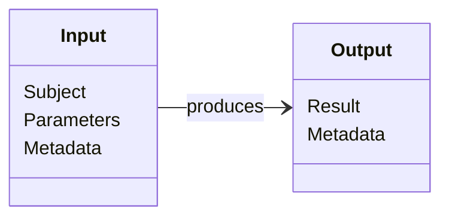
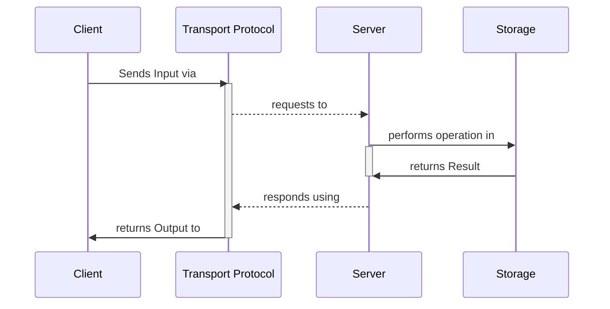

import CrudVerbsTable from '../../../components/CrudVerbsTable.astro';
import CrudOperationsTable from '../../../components/CrudOperationsTable.astro';
import TermDefinition from '../../../components/TermDefinition.astro';

## 2.1 CRUD Definition

---

**"CRUD"** is an acronym popularized in the early 1980s that encompasses two kinds of operations applied to Resources:

1. **Read operations**—such as querying, extracting, and aggregating Resources;
2. **Write operations**—which mutate the current state of Resources.

## 2.2 Anatomy and behavior of a CRUD operation

---

Traditionally, a **CRUD operation** is made of:

- **Input:** data used to perform the operation, broken down into:
    - **Subject:** the operation required data —such as Resource Objects, Search Queries, or Resource IDs;
    - **Parameters:** optional data that influences the operation behavior ****—such as sorting, projection, filtering, and pagination; and
    - **Metadata**—such as client-server negotiation information (content-type, encoding, serialization), metadata related to the operation, and client/server capabilities.
- **Output:** data returned from the operation, including:
    - **Result**—the result data, whether a Resource Object, an error, or null; and
    - **Metadata**—same as the **Input** metadata.

Therefore, a CRUD operation involves several **Participants**. This spec frequently cites them as the following terms:

- **Client**: The participant that initiates the CRUD operation with standardized Input data—for example, a web server writing to a database or a mobile app requesting data from a web API.
- **Transport Protocol**: The protocol used to 1) encapsulate the Input data sent to the Server and 2) return the Result to the Client. Examples include RESTful HTTP, JSON-RPC, and MCP.
- **Server**: The participant that performs the operation using the Input data and outputs the standardized Result—for example, a web API or database library compliant to this spec.
- **Storage:** The final destination where the operation is performed to the Resources, such as a database, filesystem, or another CRUD API.

## 2.3 The CRUD verbs

---

The CRUD API Spec redefines a set of verbs that goes beyond the traditional CRUD acronym. The HTTP Protocol methods themselves transcended these four traditional operations. For example, the "Retrieve" and the "Update" words hold ambiguous meanings that should be splitted into their distinct actions, such as list/get and patch/replace.

Given a Resource Type, the following table below describes and illustrates the **CRUD verbs**:

<CrudVerbsTable />

## 2.4 The CRUD operations

---

Depending on the **Subject**, each verb can be executed differently. The CRUD verbs are therefore derived into the following **operations**, sometimes suffixed with the Subject type:

<CrudOperationsTable />

## 2.5 General terminology

---

In addition to terms that appear in double quotes and bold formatting throughout this document, this spec frequently references the following terms and definitions:

<TermDefinition termId="slug" />

<TermDefinition termId="uuid-hex" />

<TermDefinition termId="uuid-base64url" />

<TermDefinition termId="uuid-ecson" />